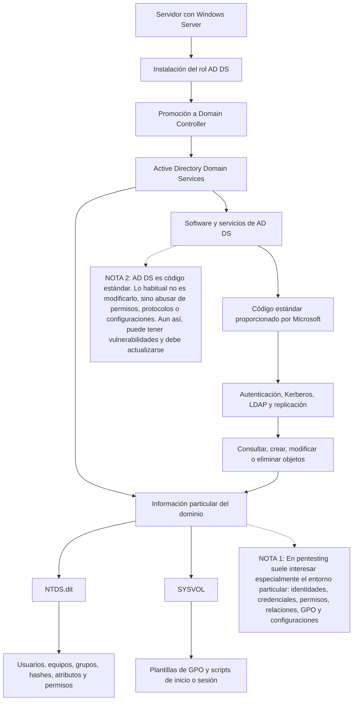

# Active Directory

Modelo mental inicial para distinguir el software de Active Directory Domain Services de la información propia de cada dominio.

## El motor estándar y el entorno particular

Active Directory Domain Services (**AD DS**) debe instalarse como un **rol de Windows Server**. Después, el servidor se promociona a **controlador de dominio**. Un Windows cliente normal, como Windows 10 u 11, puede unirse al dominio, pero no se convierte por ello en controlador de dominio.

## Idea clave

> **El software de AD DS es el motor estándar que ejecuta las operaciones; `NTDS.dit` y `SYSVOL` contienen el entorno particular de la empresa sobre el que trabaja ese motor.**

Esta separación permite distinguir dos partes:

1. **Motor estándar:** componentes de AD DS instalados en Windows Server. Implementan autenticación, Kerberos, LDAP, replicación y las operaciones para consultar, crear, modificar o eliminar objetos.
2. **Entorno particular del dominio:** usuarios, equipos, grupos, credenciales, permisos, políticas y configuraciones creados por cada organización.

`NTDS.dit` es la base de datos del directorio. Guarda objetos y atributos como usuarios, equipos, grupos, hashes de contraseñas, relaciones y permisos. `SYSVOL` no contiene el software de AD DS: es una carpeta compartida que almacena principalmente plantillas de políticas de grupo y scripts de inicio o sesión.

Cuando se añade otro controlador de dominio, AD DS se instala en el nuevo Windows Server y este se promociona. El software no se copia desde el primer DC: lo que se replica entre controladores son los datos del directorio y el contenido de `SYSVOL`.

En un pentest de Active Directory, lo habitual es estudiar y abusar del entorno particular: credenciales débiles, permisos excesivos, delegaciones, relaciones, GPO y configuraciones inseguras. Atacar directamente el código de AD DS es menos frecuente, aunque el software puede contener vulnerabilidades y debe mantenerse actualizado.
